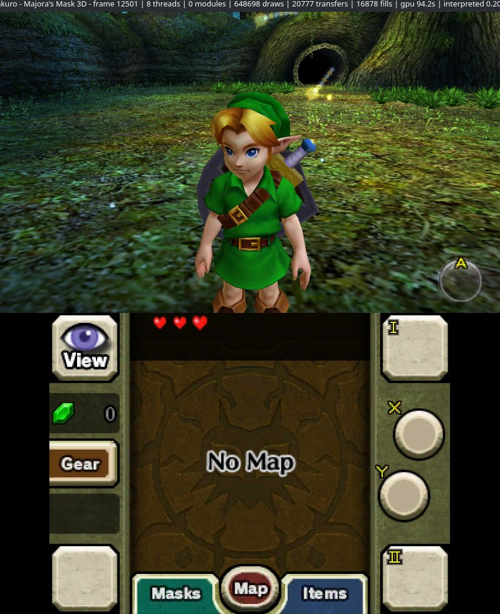

# Zakuro

A WIP HLE Nintendo 3DS emulator written in Rust that uses ahead-of-time (AOT) recompilation instead of a JIT.

  
  
  

I started developing this project in October 2025, before
[feargba](https://github.com/fearkov/feargba). 

I first wrote it in C++, but I was learning Rust at the time and noticed there wasn't a working 3DS emulator written in Rust, so I switched.

This is a personal experimental project. You can use it to play games, but that was never the main goal. Some games boot. Instead of translating code while the game runs, like a JIT does, Zakuro runs code recompiled ahead of time by [3dsrecomp](https://github.com/fearkov/3dsrecomp), and tested games run at full speed that way. On the interpreter alone they run below full speed.

Builds for Windows and Linux are on the [releases page](https://github.com/fearkov/zakuro/releases): on Windows, unzip it and run zakuro.exe, and on Linux, extract it and run ./zakuro.

To build it yourself you need Rust 1.95 or newer. On Linux, building also needs pkg-config and the ALSA development files (libasound2-dev on Debian and Ubuntu, alsa-lib on Arch). On Windows, nothing else is needed:

    cargo install --git https://github.com/fearkov/zakuro --locked zakuro

Cargo puts it in ~/.cargo/bin, which has to be on your PATH. Then `zakuro` in a terminal opens it. To play you need a decrypted ROM:

    zakuro path/to/rom.3ds

Without a ROM it opens a library with the games in a folder you pick, where you can also recompile them. Esc brings up a menu over the game, and the settings (controls, sound, graphics, a background for the library) are in there too.

Games run faster with their code recompiled ahead of time by [3dsrecomp](https://github.com/fearkov/3dsrecomp), which comes with Zakuro: press Recompile next to a game in the library, once per game. It takes around ten minutes and needs a C compiler, such as gcc or clang. On Windows, gcc from MinGW-w64 (through MSYS2 or WinLibs) works out of the box. From then on Zakuro runs the recompiled code on its own, and anything it doesn't cover still goes through the interpreter.

3dsrecomp also works on its own, from the terminal:

    cargo install --git https://github.com/fearkov/3dsrecomp --locked recomp3ds
    3dsrecomp build path/to/rom.3ds

--recompiled points it at another library, and --interpreter runs everything in the interpreter.

No copyrighted data is included. I do not condone piracy, and I will not help you with that. So, don't ask me about that.

Controls:

| 3DS | Keyboard |
|---|---|
| A / B / X / Y | X / Z / S / A |
| L / R | Q / W |
| Start / Select | Enter / Backspace |
| D-pad | Arrow keys |
| Circle pad | I / J / K / L |
| Touch screen | Mouse (click) |
| Menu / Pause / Fullscreen | Esc / F1 / F11 |

Contributions are welcome. Using AI is fine sometimes, but the code must always be reviewed by a human. Code that is entirely vibecoded will be discarded.

MIT license.
